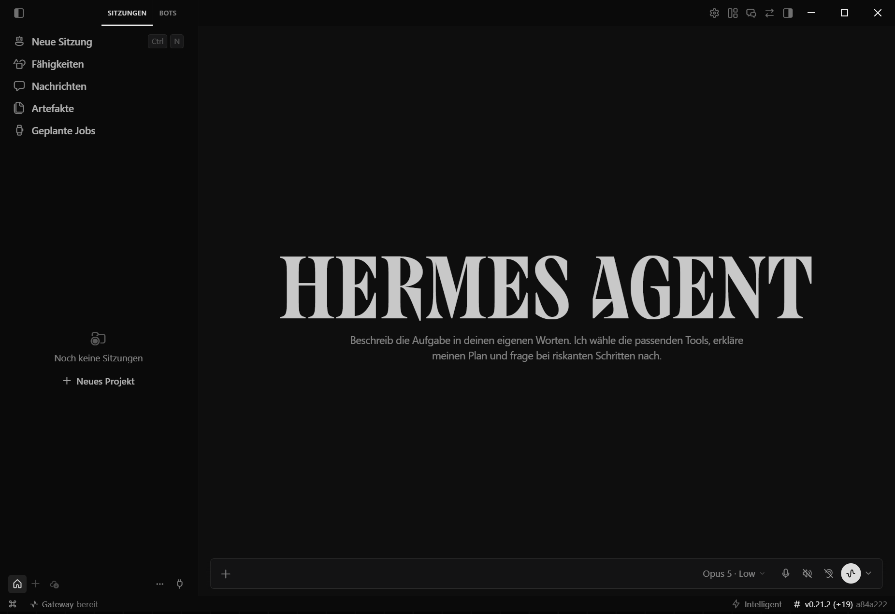
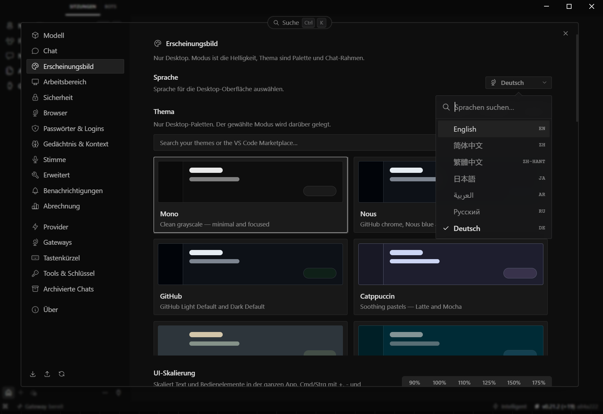
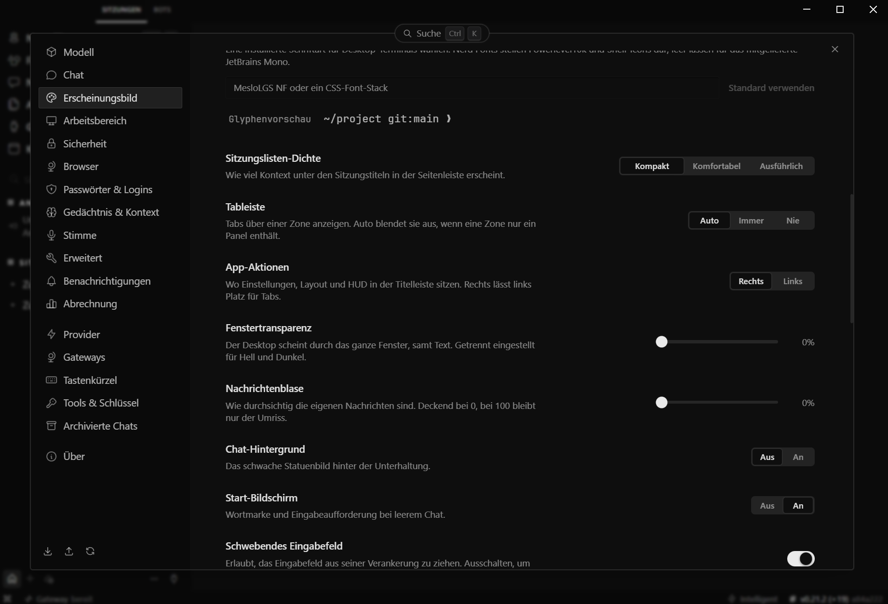
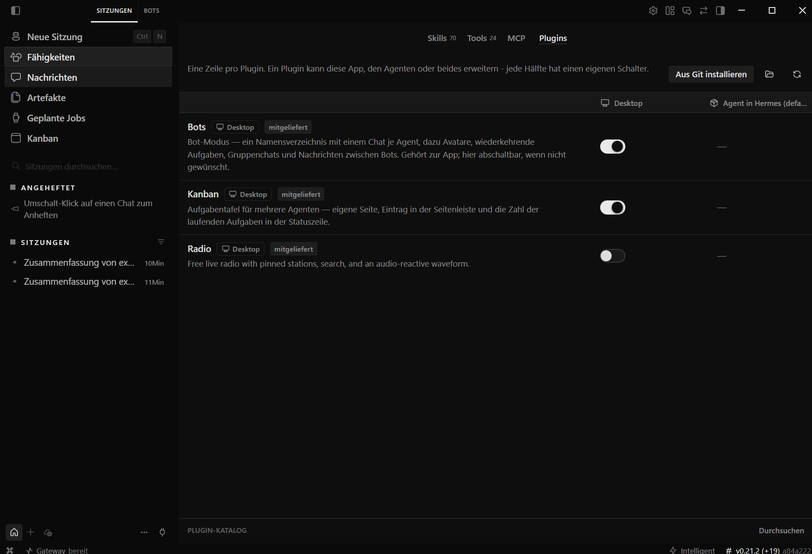

# Hermes Desktop - deutsche Locale (`de`)

**Version 1.0.0**, 12.09.2026.

Gebaut gegen **Hermes Desktop 0.17.2**, Commit `a84a2223f8`.

> Die Statuszeile der laufenden App zeigt eine **andere** Zahl, etwa
> `v0.21.2 (+19) a84a222`. Das ist kein Widerspruch: `0.21.2` ist die Version
> des Hermes-**Agenten** (`pyproject.toml`), `0.17.2` die der **Desktop-App**
> (`apps/desktop/package.json`), und übersetzt ist die Desktop-App. Der
> Commit-Kurzname in der Statuszeile ist der verlässliche Bezug - gegen ihn
> passt der Patch.

Vollständige deutsche Übersetzung der Hermes-Desktop-Oberfläche - auf allen
fünf Ebenen, auf denen Text in dieser Anwendung liegt: Kernkatalog,
Plugin-Sprachpakete, Startbildschirm, Tab-Beschriftungen und Plugin-Stammdaten.
Was sich wann geändert hat, steht in [CHANGELOG.md](CHANGELOG.md).

**Vollständig heißt hier vollständig: 3773 von 3773 Schlüsselpfaden.** Die
Datei ist als `Translations` typisiert, und dieser Typ verlangt jeden Schlüssel.
Ein fehlender wäre ein Übersetzungsfehler beim Bauen, kein stiller Rückfall auf
Englisch. `defineLocale()` für Teilfassungen wird bewusst **nicht** benutzt.

## Was hier liegt

```
0001-hermes-desktop-german-locale.patch   git-Patch gegen den Quellbaum
src/                                      dieselben Dateien einzeln, im Zuschnitt
                                          von apps/desktop/src/
installer/                                Batch zum Einspielen und Zurücknehmen
docs/BERICHT_A240.md                      Kernkatalog: Messwerte, Befunde, Fallen
docs/BERICHT_A241.md                      Plugin-Sprachpakete und Startbildschirm
docs/BERICHT_A242.md                      Tab-Beschriftungen
docs/BERICHT_A243.md                      Plugin-Stammdaten
CHANGELOG.md                              was diese Fassung enthält
```

Das fertig gebaute Programmpaket (rund 258 MB) ist **nicht** enthalten. Es ist
Ausgabe eines Builds und gehört nicht in ein Repository.

## Einbauen

```bash
cd <hermes-agent>
git apply 0001-hermes-desktop-german-locale.patch
cd apps/desktop
npx tsc --noEmit          # muss fehlerfrei sein
npx vitest run src/i18n   # 31 Tests
npm run pack
```

Wer lieber kopiert statt patcht: die Dateien unter `src/` liegen im selben
Zuschnitt wie im Quellbaum unter `apps/desktop/src/`. Neu ist einzig `de.ts`
samt den `intro-copy.<locale>.jsonl`, alles andere sind Änderungen.

## Was geändert wurde

| Datei | Änderung |
|---|---|
| `types.ts` | `Locale`-Typ um `'de'` |
| `languages.ts` | Eintrag in `LOCALE_OPTIONS`; 14 Aliasse (`de`, `de-de`, `de-at`, `de-ch`, `de-li`, `de-lu`, `german`, `deutsch` plus Unterstrichvarianten) |
| `catalog.ts` | Import und Eintrag in `TRANSLATIONS` |
| `de.ts` | **neu**, 4183 Zeilen |
| `languages.test.ts` | Zusicherungen für die deutschen Varianten |
| `context.test.tsx` | ein Testbeispiel umgestellt, siehe unten |

**Zwei bestehende Tests hielten fest, dass Deutsch NICHT unterstützt wird.**
`languages.test.ts` sicherte zu, `normalizeLocale('de')` falle auf Englisch
zurück; `context.test.tsx` nutzte `'de'` als Beispiel für eine unbekannte
Sprache. Beide mussten mit. Das zweite steht jetzt auf `'xx'`, damit der Test
weiter misst, was er messen soll.

## Der Installer ohne Toolchain

`installer/Deutsch_installieren.bat` spielt fertig gebaute Dateien auf einem
Windows-Rechner ein, auf dem nur die App liegt: kein Node, kein Quellbaum. Er
braucht einen Ordner `paket` neben sich mit `Hermes.exe`, `resources\` und
`VERSION.txt` aus einem Build (`apps/desktop/release/win-unpacked`).

**Es reicht nicht, `app.asar` zu tauschen.** Gemessen über Hashlisten vor und
nach einem Neubau: 218 von 484 Dateien ändern sich, darunter `Hermes.exe`
selbst, weil electron-builder die asar-Integritätsprüfung in die Programmdatei
stempelt. Ein reiner asar-Tausch lässt die App an ihrer eigenen Prüfung
scheitern. Der Batch spielt darum `Hermes.exe` und den ganzen `resources`-Ordner
ein, legt vorher eine Sicherung an und hat mit
`Deutsch_zuruecknehmen.bat` einen geprobten Rückweg.

## Stand stromaufwärts

Deutsch ist bei NousResearch nicht gemergt: Issue **#51217** offen, PR **#38846**
und **#69819** geschlossen. Wer eine deutsche Oberfläche will, muss sie bauen.

## Screenshots

| | |
|---|---|
|  | Startbildschirm und Tab-Leiste: SITZUNGEN, BOTS, Neue Sitzung, Fähigkeiten, Nachrichten, Artefakte, Geplante Jobs - dazu die übersetzte Eingabeaufforderung |
|  | Die Sprachauswahl, Deutsch angehakt, daneben die übersetzte Einstellungsleiste |
|  | Die Seite mit den längsten Texten: kein Beschriftungsfeld läuft über, `Kompakt / Komfortabel / Ausführlich` passt in seine Schaltergruppe |
|  | Fähigkeiten &#9656; Plugins: die Stammdaten der mitgelieferten Plugins auf Deutsch |

Deutsch ist im Schnitt länger als Englisch. Auf den Bildern ist zu sehen, dass
keine Schaltfläche überläuft und kein Text abgeschnitten wird - auch nicht in
den Einstellungen, wo die längsten Texte stehen.

**Zum Plugin-Bild, weil dort englischer Text steht.** Die Zeile `Radio` ist
absichtlich so abgebildet. Zwei Dinge sind daran zu sehen:

- Ein Plugin-Sprachpaket wird erst registriert, wenn das Plugin **eingeschaltet**
  ist (`src/plugins/kanban/plugin.tsx:89`). `Bots` und `Kanban` sind an und
  deutsch; `Radio` ist aus. Der Rückfall auf den englischen Klartext ist das
  gewollte Verhalten von `resolvePluginLabel`, nicht ein fehlender Schlüssel.
- `Radio` hat außerdem **kein deutsches Sprachpaket**. Diese Fassung übersetzt
  die Stammdaten von `hermes-bots` und `kanban`; das dritte mitgelieferte
  Desktop-Plugin fehlt noch.

Der Entwurf dahinter ist die eigentliche Baustelle: die Stammdaten eines
Plugins leben nur, solange das Plugin läuft. Die Liste zeigt eine Zeile für
ein abgeschaltetes Plugin, kann sie aber nicht beschriften. Richtig wäre,
Name und Beschreibung **außerhalb** von `register()` zu führen.

## Was außerdem drin ist: Plugins und Startbildschirm

Eine Uebersetzung des Kernkatalogs macht die Oberfläche noch nicht deutsch.
Zwei Stellen liegen außerhalb und wurden mitgenommen.

**Die Plugins.** `hermes-bots` und `kanban` bringen eigene Sprachpakete mit
(`PluginLocaleBundles` in `src/plugins/<name>/i18n.ts`), getrennt vom
Kernkatalog. Sie führten `en, ja, zh, zh-hant`. Es fehlte also nicht nur
Deutsch, sondern auch **Russisch und Arabisch**, obwohl die App beide anbietet:
wer dort umstellte, sah `SESSIONS` und `BOTS` auf Englisch. Ergänzt wurden
alle drei, je 195 (bots) und 178 (kanban) Schlüssel. Die Bündel sind
typisiert, ein fehlender Schlüssel fällt beim Bauen auf.

**Der Startbildschirm.** `intro-copy.jsonl` hält 75 Begrüßungstexte
(15 Persönlichkeiten a 5 Varianten) und wurde ohne jeden Sprachbezug geladen.
Es gab dort keinen Platz für eine zweite Sprache. Jetzt gibt es
`intro-copy.<locale>.jsonl` je Sprache, `resolveCopy` bekommt die aktive Locale,
und fehlt einer Sprache ein Eintrag, greift der englische. 6 Sprachen mal
75 Texte.

Englisch bleibt eine Stelle: die Notfalltexte für Persönlichkeiten, die ein
Nutzer selbst anlegt und für die es in keiner Sprache Texte geben kann.

## Und eine vierte Stelle: die Tab-Beschriftungen

Nach Katalog, Plugins und Startbildschirm stand oben im Fenster weiter
`SESSIONS`, `BOTS`, `NEW SESSION`, `TERMINAL`, `FILES`. Diese Texte lagen in
keinem der drei Systeme, weil sie **keine Übersetzungsschlüssel waren**:
gewöhnliche Konstanten im Code, die zugleich als Kennung der Fläche dienen
(`title: 'sessions'`).

Die Doppelrolle ist jetzt getrennt. `title` bleibt unverändert die englische
Kennung - Zonenmenü, Tastenkürzel und der persistierte Layoutbaum hängen
daran. Der sichtbare Text kommt aus `PaneChrome.tabTitle`, einer **Funktion**,
die bei jedem Zeichnen aufgerufen wird. Damit greift auch ein Sprachwechsel
sofort, statt erst beim nächsten Start.

Neu im Katalog: `zones.paneTitles` (sechs Schlüssel) in allen sieben Sprachen,
im Plugin `hermes-bots` entsprechend `pane.title`. Aus der Konstante
`NEW_SESSION_TITLE` wurde die Funktion `newSessionTitle()`; eine Konstante
würde die Sprache des ersten Imports einfrieren.

Nicht übersetzt ist `name: 'Bots'` in `plugins/hermes-bots/plugin.tsx`: das ist
kein Tab, sondern der Plugin-Name in der Plugin-Verwaltung, und für
Plugin-Stammdaten gibt es in Hermes keinen Uebersetzungsweg.

Messwerte und Befunde: `docs/BERICHT_A242.md`.

---

## For an upstream pull request

This adds a complete German (`de`) locale as requested in issue #51217. All
3773 translation keys are present: `de.ts` is typed as `Translations`, so the
compiler rejects a missing key rather than silently falling back to English.
`defineLocale()` is deliberately not used.

Note that two existing assertions had to change, because they encoded the
absence of German: `languages.test.ts` asserted `normalizeLocale('de')` returns
English, and `context.test.tsx` used `'de'` as its example of an unsupported
configured language (now `'xx'`).

Checked with `tsc --noEmit` and `vitest run src/i18n` (31 passing).

This also covers two surfaces outside the core catalog, which is why the diff
is larger than a locale file:

- **Plugin bundles.** `hermes-bots` and `kanban` carry their own
  `PluginLocaleBundles`, which listed `en, ja, zh, zh-hant`. That gap was not
  German-only: `ru` and `ar` were missing too, so users who switched to those
  languages still saw English labels. All three are added.
- **Intro copy.** `intro-copy.jsonl` was loaded with no locale awareness at all,
  so the start screen stayed English in every language. It is now one file per
  locale with an English fallback, and `Intro` reads the active locale.
- **Pane tab labels.** `SESSIONS`, `BOTS`, `NEW SESSION`, `TERMINAL`, `FILES`
  were plain code constants that doubled as the pane's IDENTIFIER, so no
  translation pass could have found them. `title` now stays the English
  identifier (the persisted layout tree, the zone menu and the keybinds key off
  it) and the visible label moves to `PaneChrome.tabTitle` - a function, so a
  language switch takes effect on the next render rather than the next start.
  `NEW_SESSION_TITLE` becomes `newSessionTitle()` for the same reason: a module
  constant would freeze the language of the first import.

The intro change touches code rather than data, so it is a **separate commit**
and can be dropped without losing the locale itself.
